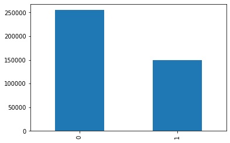
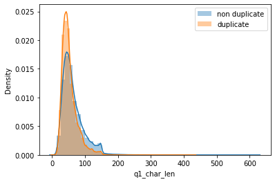
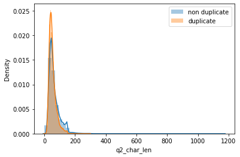
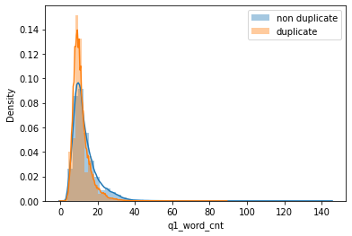
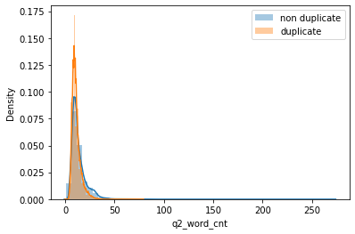
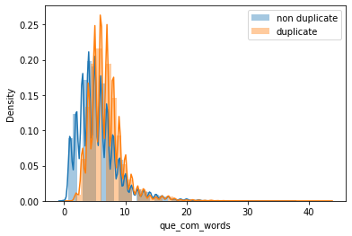
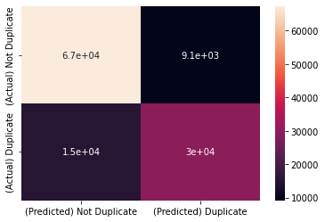

# Sentence to Sentence Semantic Similarity

## Introduction

A Natural Language Proccessing **(NLP)** to guess whether 2 questions have the same meaning **(duplicate)**.

## Methodologies
- preprocessing
    - dropping all rows that have any null cell
- feature selection
    1. the question characters length.
    2. word count of the question.
    3. common words between the 2 questions.
    4. term frequency-inverse document frequency **(tfidf)**.
- model **(The Random forest classifier)**
    - Describtion
    >  The Random forest classifier creates a set of decision trees from a randomly selected subset of the training set. It is basically a set of decision trees (DT) from a randomly selected subset of the training set and then It collects the votes from different decision trees to decide the final prediction.
    - Advantages
        1. The random forest algorithm is significantly more accurate than most of the non-linear classifiers.
        2. The random forest classifier doesn’t face the overfitting issue because it takes the average of all predictions, canceling out the biases and thus, fixing the overfitting problem.
        3. Random forests don’t let missing values cause an issue. They can use median values to replace the continuous variables or calculate the proximity-weighted average of the missing values to solve this problem.

## Dataset Summary

- The dataset used:
    > Quora Question Pairs.

- The summary of data set columns:
    > | column name  | summary                                      |
    > |--------------|----------------------------------------------|
    > | id           | unique id                                    |
    > | qid1         | question id of the question 1                |
    > | qid2         | question id of the question 2                |
    > | is_duplicate | wheather the 2 questions are duplicate (1/0) |
    
- Dataset statistics:

    

    

    

    

    

    

## Results

> Accuracy ~= 80%
    
